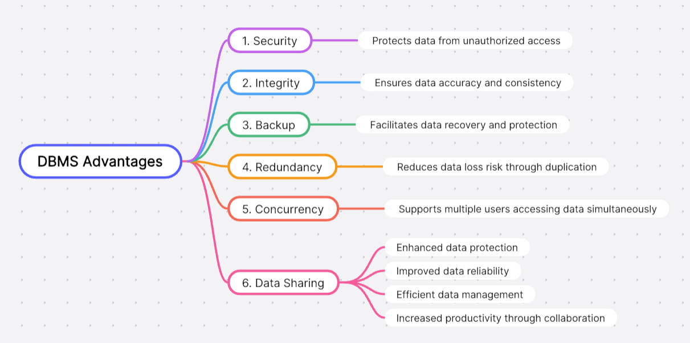

#  Database Report

This report explores key concepts in databases, including comparisons, database types, cloud storage, and roles in DB projects.

---

## Flat File Systems vs. Relational Databases

| Feature           | Flat File System                    | Relational Database                   |
|------------------|-------------------------------------|---------------------------------------|
| **Structure**     | Plain text or CSV files             | Tables with rows and columns          |
| **Data Redundancy** | High – data is often repeated        | Low – data is normalized and related  |
| **Relationships** | Not supported                       | Supports relationships with keys      |
| **Example Usage** | Excel sheets, small logs            | Banking, school systems, inventory    |
| **Drawbacks**     | Hard to update and manage           | Requires knowledge of SQL             |

 **Reference**:  
[GeeksForGeeks - DBMS Introduction](https://www.geeksforgeeks.org/introduction-of-dbms-database-management-system-set-1/)

---

##  DBMS Advantages – Mind Map

This is a visual mind map showing the advantages of using a DBMS:

 

 **Key Points**:
- **Security**: Control user access
- **Integrity**: Maintain accuracy of data
- **Backup**: Regular backups possible
- **Redundancy**: Reduce duplicate data
- **Concurrency**: Multiple users at once
- **Data Sharing**: Easy sharing between apps/users

---

##  Roles in a Database System

| Role                      | What They Do |
|---------------------------|--------------|
| **System Analyst**        | Understands user needs and creates system plan |
| **Database Designer**     | Designs the structure (tables, relationships) |
| **Database Developer**    | Builds the database using code |
| **Database Administrator (DBA)** | Maintains performance, security, and backups |
| **Application Developer** | Creates software that uses the database |
| **BI Developer**          | Builds dashboards and data reports |

 **Reference**:  
[Oracle Documentation](https://docs.oracle.com/en/database/)

---

## Types of Databases

## Relational vs. Non-Relational
- **Relational (SQL)**: Data in tables with schemas (e.g., MySQL, PostgreSQL)
- **Non-Relational (NoSQL)**: Flexible formats like JSON (e.g., MongoDB, Cassandra)

###  Centralized vs. Distributed vs. Cloud
- **Centralized**: All data on one server
- **Distributed**: Spread across multiple locations
- **Cloud**: Stored and managed online

| Type             | Example            | Use Case              |
|------------------|--------------------|------------------------|
| Relational        | MySQL              | Banking, HR            |
| Non-Relational    | MongoDB            | Social media, apps     |
| Centralized       | MS Access          | Local systems          |
| Distributed       | Apache Cassandra   | Global e-commerce      |
| Cloud             | Google Cloud SQL   | Scalable web services  |

 **References**:
- [MongoDB vs MySQL](https://www.mongodb.com/compare/mongodb-vs-mysql)
- [IBM Database Types](https://www.ibm.com/topics/databases)

---

##  Cloud Storage and Databases

###  What is Cloud Storage?
Cloud storage stores data on the internet (e.g., Google Drive, AWS S3). Cloud databases are hosted on these platforms.

###  Advantages of Cloud Databases:
- Access from anywhere
- Automatic backups and scaling
- No need to manage physical servers

### Disadvantages:
- Needs internet connection
- Security depends on provider
- Can be expensive at large scale

###  Examples of Cloud Databases:
- Amazon RDS
- Azure SQL
- Google Cloud Spanner

**Reference**:  
- [Google Cloud Spanner](https://cloud.google.com/spanner)  
- [AWS RDS](https://aws.amazon.com/rds/)

